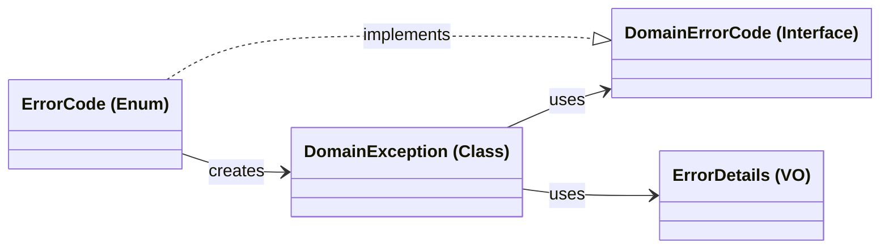

# Error Handling Guide

This guide outlines a domain-centric error handling strategy for a Java application, designed to be independent of any specific framework. The core principle is the exclusive use of a single, unified `DomainException` for all business rule violations within the domain layer.

---

## Core Components

The error handling architecture consists of four key components:

1.  **`DomainErrorCode` (Interface)**: A common contract for all domain-specific error enums.
2.  **`DomainException` (Class)**: The single, unified exception type thrown by the domain layer.
3.  **`ErrorDetails` (Value Object)**: An immutable container for structured, contextual information about an error.
4.  **`<Domain>ErrorCode` (Enum)**: A concrete implementation of `DomainErrorCode` for a specific domain, which also acts as a factory for `DomainException`.

### Dependency Structure



---

## 1. `DomainErrorCode` Interface

This interface defines the essential contract for any error code enum within the domain.

```java
public interface DomainErrorCode {
    // Default message for logging or as a fallback.
    String defaultMessage();

    // Unique identifier (e.g., enum name) for serialization and mapping.
    String name();
}
```

---

## 2. `ErrorDetails` Value Object

An immutable value object designed to hold structured key-value data about an error.

```java
import java.util.Map;
import java.util.LinkedHashMap;

public final class ErrorDetails {
    private final Map<String, Object> values;

    private ErrorDetails(Map<String, Object> src) {
        this.values = (src == null) ? Map.of() : Map.copyOf(src);
    }

    public static ErrorDetails empty() {
        return new ErrorDetails(null);
    }

    // Creates details from key-value pairs, e.g., "userId", 123
    public static ErrorDetails of(Object... kvPairs) {
        if (kvPairs == null || kvPairs.length == 0) {
            return empty();
        }
        if (kvPairs.length % 2 != 0) {
            throw new IllegalArgumentException("kvPairs must have an even number of elements.");
        }
        var map = new LinkedHashMap<String, Object>();
        for (int i = 0; i < kvPairs.length; i += 2) {
            map.put(String.valueOf(kvPairs[i]), kvPairs[i + 1]);
        }
        return new ErrorDetails(map);
    }

    public Map<String, Object> asMap() {
        return values;
    }
}
```

---

## 3. `DomainException` Class

This is the **only** exception that should be thrown from the domain layer to signal a business rule violation. It encapsulates the `DomainErrorCode` and optional `ErrorDetails`.

```java
public class DomainException extends RuntimeException {
    private final DomainErrorCode code;
    private final ErrorDetails details;

    private DomainException(DomainErrorCode code, String message, ErrorDetails details) {
        super(message != null ? message : code.defaultMessage());
        this.code = code;
        this.details = (details == null) ? ErrorDetails.empty() : details;
    }

    public static DomainException of(DomainErrorCode code) {
        return new DomainException(code, null, null);
    }

    public static DomainException of(DomainErrorCode code, ErrorDetails details) {
        return new DomainException(code, null, details);
    }

    public DomainErrorCode code() {
        return code;
    }

    public ErrorDetails details() {
        return details;
    }
}
```

---

## 4. Error Code Enum Implementation

Each bounded context or domain should define its own enum that implements `DomainErrorCode`. This enum contains specific error conditions and provides factory methods (`ex`) to create `DomainException` instances.

```java
// Example for an "Order" domain
public enum OrderErrorCode implements DomainErrorCode {
    ORDER_NOT_FOUND("Order not found."),
    ORDER_ALREADY_PAID("Order has already been paid."),
    ORDER_NOT_CANCELLABLE("Order cannot be cancelled in its current state."),
    INVALID_QUANTITY("Quantity must be positive.");

    private final String defaultMessage;

    OrderErrorCode(String defaultMessage) {
        this.defaultMessage = defaultMessage;
    }

    @Override
    public String defaultMessage() {
        return defaultMessage;
    }

    // --- Exception Factory Methods ---

    // Returns a DomainException for this error code.
    public DomainException ex() {
        return DomainException.of(this);
    }

    // Returns a DomainException with details from key-value pairs.
    public DomainException ex(Object... kvPairs) {
        return DomainException.of(this, ErrorDetails.of(kvPairs));
    }
}
```

---

## 5. Usage in Domain Logic

To use the pattern, call the `ex()` factory method on the relevant error code enum when a business rule is violated.

```java
public final class Order {
    private final OrderId orderId;
    private OrderStatus status;

    public void cancel() {
        if (!status.isCancellable()) {
            // Throws DomainException with code ORDER_NOT_CANCELLABLE
            // and details containing the orderId and current status.
            throw OrderErrorCode.ORDER_NOT_CANCELLABLE.ex(
                "orderId", this.orderId.value(),
                "currentStatus", this.status
            );
        }
        this.status = OrderStatus.CANCELLED;
    }
}
```

The calling layer (Application or Interface) is responsible for catching `DomainException` and mapping it to an appropriate response, such as an HTTP status code and a formatted body.