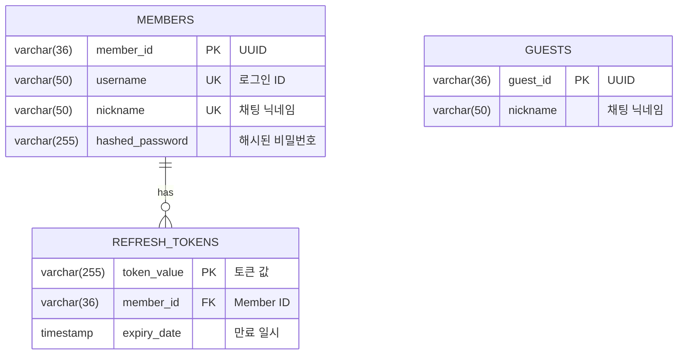
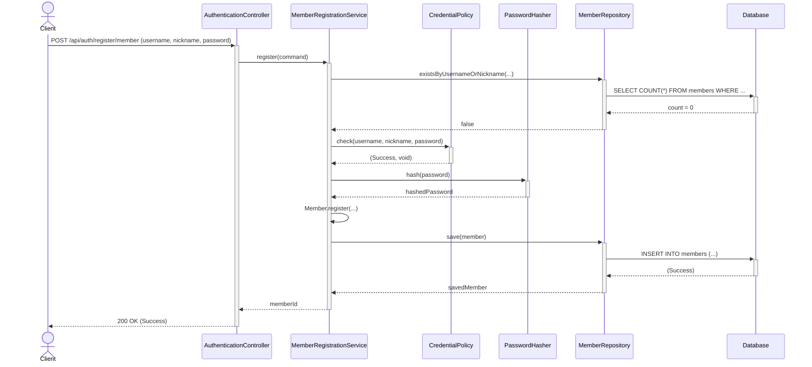
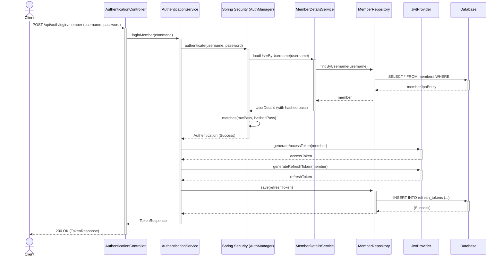
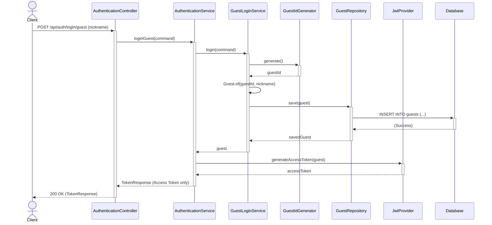

# PROJECT_TECH.md

이 문서는 시스템의 기술적인 구현 세부사항을 다이어그램으로 명세합니다.
주요 내용은 **ERD(Entity-Relationship Diagram)**와 **주요 흐름에 대한 시퀀스 다이어그램**입니다.

---

## 1. ERD (Entity-Relationship Diagram)

H2 데이터베이스 스키마 기준의 ERD입니다.

**설계 요점:**
*   `MEMBERS`와 `GUESTS` 테이블은 완전히 분리되어 사용자의 유형을 명확히 구분합니다.
*   `username`과 `nickname`은 `MEMBERS` 테이블 내에서 고유해야 합니다 (UK: Unique Key).
*   `REFRESH_TOKENS` 테이블은 Member의 Refresh Token을 저장하여 상태 기반의 토큰 재발급을 지원합니다.

---

## 2. 시퀀스 다이어그램 (Sequence Diagrams)

### 2.1 회원 가입 (Member Registration)

### 2.2 회원 로그인 (Member Login)

### 2.3 게스트 로그인 (Guest Login)

